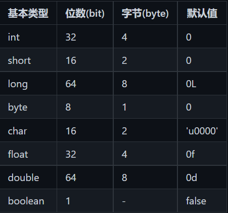

1. 并发（Concurrent），在操作系统中，是指一个时间段中有几个程序都处于已启动运行到运行完毕之间，且这几个程序都是在同一个处理机上运行。例如：单cpu计算机同时打开多个应用程序，通过时间片的方式实现并发。
2. 同步：用于解决并发问题，给予线程权限，允许具有权限的线程执行。
3. 并行（Parallel），当系统有一个以上CPU时，当一个CPU执行一个进程时，另一个CPU可以执行另一个进程，两个进程互不抢占CPU资源，可以同时进行，这种方式我们称之为并行(Parallel)。
4. ### volatile 
    Java语言提供了一种稍弱的同步机制，即volatile变量，用来确保将变量的更新操作通知到其他线程。当把变量声明为volatile类型后，编译器与运行时都会注意到这个变量是共享的，因此不会将该变量上的操作与其他内存操作一起重排序。volatile变量不会被缓存在寄存器或者对其他处理器不可见的地方，因此在读取volatile类型的变量时总会返回最新写入的值。  
    在访问volatile变量时不会执行加锁操作，因此也就不会使执行线程阻塞，因此volatile变量是一种比sychronized关键字更轻量级的同步机制
    当对非 volatile 变量进行读写的时候，每个线程先从内存拷贝变量到CPU缓存中。如果计算机有多个CPU，每个线程可能在不同的CPU上被处理，这意味着每个线程可以拷贝到不同的 CPU cache 中。
    而声明变量是 volatile 的，JVM 保证了每次读变量都从内存中读，跳过 CPU cache 这一步。  
    当一个变量定义为 volatile 之后，将具备两种特性：
    1.保证此变量对所有的线程的可见性，这里的“可见性”，如本文开头所  述，  当一个线程修改了这个变量的值，volatile 保证了新值能立即同步到主   内存，以及每次使用前立即从主内存刷新。但普通变量做不到这点，普通变量的值在线程间传递均需要通过主内存（详见：Java内存模型）来完成。  
    2.禁止指令重排序优化。有volatile修饰的变量，赋值后多执行了一个“load addl $0x0, (%esp)”操作，这个操作相当于一个内存屏障（指令重排序时不能把后面的指令重排序到内存屏障之前的位置），只有一个CPU访问内存时，并不需要内存屏障；（什么是指令重排序：是指CPU采用了允许将多条指令不按程序规定的顺序分开发送给各相应电路单元处理）。
    volatile 性能：volatile 的读性能消耗与普通变量几乎相同，但是写操作稍慢，因为它需要在本地代码中插入许多内存屏障指令来保证处理器不发生乱序执
5. ### 内存屏障 (Memory Barrier)
    Memory barrier 能够让 CPU 或编译器在内存访问上有序。一个 Memory barrier 之前的内存访问操作必定先于其之后的完成。
    Memory barrier是一种CPU指令，用于控制特定条件下的重排序和内存可见性问题。Java编译器也会根据内存屏障的规则禁止重排序。
    有的处理器的重排序规则较严，无需内存屏障也能很好的工作，Java编译器会在这种情况下不放置内存屏障。
6. ### 自旋锁 VS 适应性自旋锁
    在许多场景中，同步资源的锁定时间很短，为了这一小段时间去切换线程，线程挂起和恢复现场的花费可能会让系统得不偿失。如果物理机器有多个处理器，能够让两个或以上的线程同时并行执行，我们就可以让后面那个请求锁的线程不放弃CPU的执行时间，看看持有锁的线程是否很快就会释放锁。
    而为了让当前线程“稍等一下”，我们需让当前线程进行自旋，如果在自旋完成后前面锁定同步资源的线程已经释放了锁，那么当前线程就可以不必阻塞而是直接获取同步资源，从而避免切换线程的开销。这就是自旋锁。
    
7. ### 轻量级
   轻量级是指它的创建和销毁不需要消耗太多的资源，意味着可以在程序中经常创建和销毁 session 的对象；重量级意味不能随意的创建和销毁它的实例，会占用很多的资源。
8. ### 无锁 VS 偏向锁 VS 轻量级锁 VS 重量级锁
   这四种锁是指锁的状态，专门针对synchronized的。在介绍这四种锁状态之前还需要介绍一些额外的知识。
9. ### 线程执行互斥代码的过程：
    1>获得互斥锁（进入synchronized代码块）
    2>清空工作内存
    3>从主内存拷贝变量的最新副本到工作内存
    4>执行代码
    5>将更改后的共享变量的值刷新到主内存
    6>释放互斥锁（退出synchronized代码块）

10. ### Exception和Error的区别
    两者的都是Throwable类的子类，按照Java源码当中注释的说明，两者的区别主要在于：
    Error类层次结构描述了Java运行时系统的内部错误和资源耗尽错误。应用程序不应该抛出这种类型的对象。如果出现了这样的内部错误，除了通告给用户，并尽力使程序安全地终止之外，再也无能为力了。这种情况很少出现。
    而Exception则表示合理的程序可能会尝试去捕捉的问题。主要分为受检查(checked)的Exception和不可检查(unchecked)的Exception:
    大多数Exception都属于受检查的，受检查的Exception在代码中必须进行捕获(try…catch)处理。  
    RuntimeException和它的子类是不可检查的。不受检查的Exception不强制是否必须进行捕捉。
    另外，由程序错误导致的异常属于RuntimeException；而程序本身没有问题，但由于像I/O错误这类问题导致的异常属于其他异常。
11. ### String能被继承吗？
    String是不能被继承的，这是因为String被设计成了final类型。
12. ### Java有哪些基本数据类型
    Java共有8种基本数据类型：byte, char, short, int, long, float, double, boolean
    其位数与默认值如下表所示：
    
13. 深拷贝和浅拷贝的区别？
    深拷贝拷贝的是对象的内容，而浅拷贝拷贝的是对象的引用。
    以数组为例，**Arrays.copyOf()**创建的就是数组的深拷贝，在进行深拷贝之后，对两个数组进行操作并不会相互影响；
    而如果直接对新对象赋值，则进行的是浅拷贝，这时操作其中一个数组，从另一个数组变量（其实存储的是引用）进行读取会发现内容也发现了改变。
14. ### 什么是多态？多态有什么好处？
    多态指的是同一个接口根据不同的对象进行不同的操作，直接体现是父类的引用可以指向子类的对象，或者是接口的引用可以指向实现类的对象。
    多态的好处有：
    - 降低耦合度
    - 使得操作可以接口化，提高可扩展性
15. Arrays.sort()的原理？
    - 首先判断数组长度，如果排序的长度小于阈值，就使用双枢纽快排。
    - 之后评估乱序程度：用run数组记录每个单调子数组的开始下标，用count记录单调子数组的个数
    如果乱序程度较高，就使用双枢纽快排
    如果乱序程度低，则使用归并排序
    对于双枢纽快排的详细实现，可以自行通过IDEA等IDE查看源代码，或上网查阅相关解析。这里不做详细介绍。
16. 反射
反射是为了解决在运行期，对某个实例一无所知的情况下，如何调用其方法。

17. 重载和重写的区别？
链接：<https://www.nowcoder.com/questionTerminal/7b2152a85b9a4ebab6dfda7e995a8491>
来源：牛客网

方法重写的原则：

重写方法的方法名称、参数列表必须与原方法的相同，返回类型可以相同也可以是原类型的子类型(从Java SE5开始支持)。
重写方法不能比原方法访问性差（即访问权限不允许缩小）。
重写方法不能比原方法抛出更多的异常。
被重写的方法不能是final类型，因为final修饰的方法是无法重写的。
被重写的方法不能为private，否则在其子类中只是新定义了一个方法，并没有对其进行重写。
被重写的方法不能为static。如果父类中的方法为静态的，而子类中的方法不是静态的，但是两个方法除了这一点外其他都满足重写条件，那么会发生编译错误；反之亦然。即使父类和子类中的方法都是静态的，并且满足重写条件，但是仍然不会发生重写，因为静态方法是在编译的时候把静态方法和类的引用类型进行匹配。
重写是发生在运行时的，因为编译期编译器不知道并且没办法确定该去调用哪个方法，JVM会在代码运行的时候作出决定。
方法重载的原则：

方法名称必须相同。
参数列表必须不同（个数不同、或类型不同、参数类型排列顺序不同等）。
方法的返回类型可以相同也可以不相同。
仅仅返回类型不同不足以成为方法的重载。
重载是发生在编译时的，因为编译器可以根据参数的类型来选择使用哪个方法。
重写和重载的不同：

方法重写要求参数列表必须一致，而方法重载要求参数列表必须不一致。
方法重写要求返回类型必须一致(或为其子类型)，方法重载对此没有要求。
方法重写只能用于子类重写父类的方法，方法重载用于同一个类中的所有方法。
方法重写对方法的访问权限和抛出的异常有特殊的要求，而方法重载在这方面没有任何限制。
父类的一个方法只能被子类重写一次，而一个方法可以在所有的类中可以被重载多次。
重载是编译时多态，重写是运行时多态。  
18. ### 接口和抽象类的区别是什么？
Java提供和支持创建抽象类和接口。它们的实现有共同点，不同点在于：
接口中所有的方法隐含的都是抽象的。而抽象类则可以同时包含抽象和非抽象的方法。
类可以实现很多个接口，但是只能继承一个抽象类
类可以不实现抽象类和接口声明的所有方法，当然，在这种情况下，类也必须得声明成是抽象的。
抽象类可以在不提供接口方法实现的情况下实现接口。
Java接口中声明的变量默认都是final的。抽象类可以包含非final的变量。
Java接口中的成员函数默认是public的。抽象类的成员函数可以是private，protected或者是public。
接口是绝对抽象的，不可以被实例化，抽象类也不可以被实例化。
也可以参考JDK8中抽象类和接口的区别
另外，从设计层面来说，抽象是对类的抽象，是一种模板设计，接口是行为的抽象，是一种行为的规范。
19. Java 到底是值传递还是引用传递？
    <https://www.zhihu.com/question/31203609/answer/50992895>
20. 创建线程有几种不同的方式？你喜欢哪一种？为什么？

 链接：<https://www.nowcoder.com/questionTerminal/e33c72bceb4343879948342e2b6e3bca>
来源：牛客网

①继承Thread类（真正意义上的线程类），是Runnable接口的实现。

②实现Runnable接口，并重写里面的run方法。

③使用Executor框架创建线程池。Executor框架是juc里提供的线程池的实现。

调用线程的start()：启动此线程；调用相应的run()方法

继承于Thread类的线程类，可以直接调用start方法启动线程（使用static也可以实现资源共享）.一个线程（对象）只能够执行一次start()，而且不能通过Thread实现类对象的run()去启动一个线程。

实现Runnable接口的类需要再次用Thread类包装后才能调用start方法。（三个Thread对象包装一个类对象，就实现了资源共享）。

线程的使用的话，注意锁和同步的使用。（多线程访问共享资源容易出现线程安全问题）

一般情况下，常见的是第二种。

- Runnable接口有如下好处：

*①避免点继承的局限，一个类可以继承多个接口。

*②适合于资源的共享

/*

- Thread的常用方法：

- 1.start()：启动线程并执行相应的run()方法

- 2.run():子线程要执行的代码放入run()方法中

- 3.currentThread()：静态的，调取当前的线程

- 4.getName():获取此线程的名字

- 5.setName():设置此线程的名字

- 6.yield():调用此方法的线程释放当前CPU的执行权（很可能自己再次抢到资源）

- 7.join():在A线程中调用B线程的join()方法，表示：当执行到此方法，A线程停止执行，直至B线程执行完毕，

- A线程再接着join()之后的代码执行

- 8.isAlive():判断当前线程是否还存活

- 9.sleep(long l):显式的让当前线程睡眠l毫秒  (只能捕获异常，因为父类run方法没有抛异常)

- 10.线程通信（方法在Object类中）：wait()   notify()  notifyAll()

*

 *设置线程的优先级（非绝对，只是相对几率大些）

- getPriority()：返回线程优先值

- setPriority(int newPriority)：改变线程的优先级

 */
21. new String()和赋值字面量的区别？以及intern()运用
<https://blog.csdn.net/sc179/article/details/110050693>
<https://blog.csdn.net/ShelleyLittlehero/article/details/81196418>
<https://blog.csdn.net/sc179/article/details/110050693>
22. java中阻塞和等待的区别？
23. ArrayList的扩容机制?
24. HashMap为什么线程不安全？实现机制？
1）
25. 为什么不同的对象hashcode可能相同：
因为当输入数据量太大，哈希值却是固定32长度的，这意味着哈希值是一个有限集合，无法建立一对一关系，所以hashcode相等是有可能会发生的。
equals()相等的两个对象，hashcode()一定相等；
equals()不相等的两个对象，hashcode()有可能相等。
hashcode()不等，一定能推出equals()也不等；
hashcode()相等，equals()可能相等，也可能不等。
为什么用hashCode：
hashCode()效率是比equals()效率高的。
所以HashSet判断元素是否相等时先用hashCode()判断，如果hashCode()不同，则对象不等，如果hashCode()相同，再比较equals() ，大大提高了效率。
所以我们要保证如果重写了equals()，也要重写hashCode()
26. 什么是ThreadLocal？
27. 什么是代理模式？
28. 不可不说的Java“锁”事
<https://tech.meituan.com/2018/11/15/java-lock.html>
29. sleep和wait的区别？sleep遇到中断？
<https://blog.csdn.net/weixin_41101173/article/details/79889464>
30. Thread.sleep()为什么要抛出中断异常
<https://blog.csdn.net/u011403239/article/details/119849670>
31. java 变量在循环结构中初始化报错
<https://q.cnblogs.com/q/49090/>
32. Java内存访问重排序的研究
<https://tech.meituan.com/2014/09/23/java-memory-reordering.html>
33. 字节码文件结构
<https://blog.csdn.net/freekiteyu/article/details/100488851>
34. Java中静态代码块、构造代码块、构造函数、普通代码块
<https://www.cnblogs.com/ysocean/p/8194428.html#_label1>
35. JAVA中try、catch、finally带return的执行顺序总结
<https://www.cnblogs.com/pcheng/p/10968841.html>
36. 枚举类
<https://www.jianshu.com/p/d2cb1355653c>
37. CPU飙高，频繁GC，怎么排查？
<https://www.cnblogs.com/javastack/p/12928208.html>
38. 快速失败(fail-fast)和安全失败(fail-safe)的区别是什么？
<https://www.nowcoder.com/questionTerminal/95e4f9fa513c4ef5bd6344cc3819d3f7#:~:text=%E5%BF%AB%E9%80%9F%E5%A4%B1%E8%B4%A5%E6%98%AF%E7%9B%B4%E6%8E%A5%E5%AF%B9%E5%8E%9F%E9%9B%86%E5%90%88%E9%81%8D%E5%8E%86%E7%9A%84%EF%BC%8C%E6%95%B0%E6%8D%AE%E4%BF%AE%E6%94%B9%E5%90%8E%E5%8F%AF%E8%83%BD%E6%8A%9B%E5%87%BA%E5%BC%82%E5%B8%B8%EF%BC%8C%E8%80%8C%E5%AE%89%E5%85%A8%E5%A4%B1%E8%B4%A5%E6%98%AF%E5%AF%B9%E5%8E%9F%E9%9B%86%E5%90%88%E7%9A%84%E6%8B%B7%E8%B4%9D%E9%81%8D%E5%8E%86%E7%9A%84%EF%BC%8C%E4%B8%8D%E4%BC%9A%E6%8A%9B%E5%87%BA%E5%BC%82%E5%B8%B8%E3%80%82,%E5%BF%AB%E9%80%9F%E5%A4%B1%E8%B4%A5%E5%92%8C%E5%AE%89%E5%85%A8%E5%A4%B1%E8%B4%A5%E7%9A%84%E5%8C%BA%E5%88%AB%20Iterator%E7%9A%84%E5%AE%89%E5%85%A8%E5%A4%B1%E8%B4%A5%E6%98%AF%E5%9F%BA%E4%BA%8E%E5%AF%B9%E5%BA%95%E5%B1%82%E9%9B%86%E5%90%88%E5%81%9A%E6%8B%B7%E8%B4%9D%EF%BC%8C%E5%9B%A0%E6%AD%A4%EF%BC%8C%E5%AE%83%E4%B8%8D%E5%8F%97%E6%BA%90%E9%9B%86%E5%90%88%E4%B8%8A%E4%BF%AE%E6%94%B9%E7%9A%84%E5%BD%B1%E5%93%8D%E3%80%82>
39. Java访问控制修饰符
<https://blog.csdn.net/smilehappiness/article/details/105546702>
40. Java 重写(Override)与重载(Overload)
<https://www.runoob.com/java/java-override-overload.html#:~:text=%E6%96%B9%E6%B3%95%E7%9A%84%E9%87%8D%E5%86%99%20%28Overriding%29%E5%92%8C%E9%87%8D%E8%BD%BD%20,%28Overloading%29%E6%98%AFjava%E5%A4%9A%E6%80%81%E6%80%A7%E7%9A%84%E4%B8%8D%E5%90%8C%E8%A1%A8%E7%8E%B0%EF%BC%8C%E9%87%8D%E5%86%99%E6%98%AF%E7%88%B6%E7%B1%BB%E4%B8%8E%E5%AD%90%E7%B1%BB%E4%B9%8B%E9%97%B4%E5%A4%9A%E6%80%81%E6%80%A7%E7%9A%84%E4%B8%80%E7%A7%8D%E8%A1%A8%E7%8E%B0%EF%BC%8C%E9%87%8D%E8%BD%BD%E5%8F%AF%E4%BB%A5%E7%90%86%E8%A7%A3%E6%88%90%E5%A4%9A%E6%80%81%E7%9A%84%E5%85%B7%E4%BD%93%E8%A1%A8%E7%8E%B0%E5%BD%A2%E5%BC%8F%E3%80%82%20%281%29%E6%96%B9%E6%B3%95%E9%87%8D%E8%BD%BD%E6%98%AF%E4%B8%80%E4%B8%AA%E7%B1%BB%E4%B8%AD%E5%AE%9A%E4%B9%89%E4%BA%86%E5%A4%9A%E4%B8%AA%E6%96%B9%E6%B3%95%E5%90%8D%E7%9B%B8%E5%90%8C%2C%E8%80%8C%E4%BB%96%E4%BB%AC%E7%9A%84%E5%8F%82%E6%95%B0%E7%9A%84%E6%95%B0%E9%87%8F%E4%B8%8D%E5%90%8C%E6%88%96%E6%95%B0%E9%87%8F%E7%9B%B8%E5%90%8C%E8%80%8C%E7%B1%BB%E5%9E%8B%E5%92%8C%E6%AC%A1%E5%BA%8F%E4%B8%8D%E5%90%8C%2C%E5%88%99%E7%A7%B0%E4%B8%BA%E6%96%B9%E6%B3%95%E7%9A%84%E9%87%8D%E8%BD%BD%20%28Overloading%29%E3%80%82>
41. JNDI概述
<https://www.cnblogs.com/wlzjdm/p/7856356.html>
42. java序列化与反序列化全讲解
<https://blog.csdn.net/mocas_wang/article/details/107621010#:~:text=Java%E5%BA%8F%E5%88%97%E5%8C%96%20%E6%98%AF%E6%8C%87%E6%8A%8AJava%E5%AF%B9%E8%B1%A1%E8%BD%AC%E6%8D%A2%E4%B8%BA%E5%AD%97%E8%8A%82%E5%BA%8F%E5%88%97%E7%9A%84%E8%BF%87%E7%A8%8B%EF%BC%9B%E8%80%8C,Java%E5%8F%8D%E5%BA%8F%E5%88%97%E5%8C%96%20%E6%98%AF%E6%8C%87%E6%8A%8A%E5%AD%97%E8%8A%82%E5%BA%8F%E5%88%97%E6%81%A2%E5%A4%8D%E4%B8%BAJava%E5%AF%B9%E8%B1%A1%E7%9A%84%E8%BF%87%E7%A8%8B%E3%80%82>
